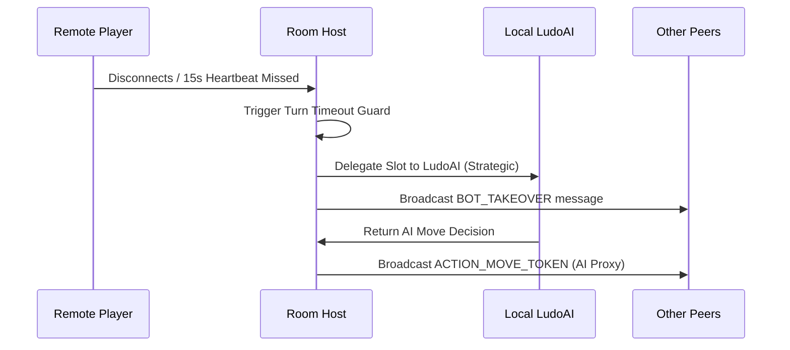

# Contract: Realtime Room Sync & Bot Takeover Protocol

**Feature**: `001-ludo-multiplayer-ai` | **Date**: 2026-08-17

This contract specifies message schemas, synchronization events, and automated bot takeover protocols for multiplayer room sessions.

---

## 1. Network Message Schemas

```typescript
export type RoomMessageType =
  | 'ROOM_JOIN'
  | 'ROOM_JOINED'
  | 'ROOM_UPDATE'
  | 'GAME_START'
  | 'ACTION_ROLL_DICE'
  | 'ACTION_MOVE_TOKEN'
  | 'STATE_SYNC'
  | 'HEARTBEAT'
  | 'PLAYER_DISCONNECTED'
  | 'BOT_TAKEOVER';

export interface BaseRoomMessage {
  type: RoomMessageType;
  roomId: string;
  senderId: string;
  timestamp: number;
}

export interface ActionRollDiceMessage extends BaseRoomMessage {
  type: 'ACTION_ROLL_DICE';
  playerIndex: number;
  rollValue: number;
}

export interface ActionMoveTokenMessage extends BaseRoomMessage {
  type: 'ACTION_MOVE_TOKEN';
  playerIndex: number;
  tokenId: string;
}

export interface StateSyncMessage extends BaseRoomMessage {
  type: 'STATE_SYNC';
  gameState: GameState;
  sequenceNumber: number;
}

export interface BotTakeoverMessage extends BaseRoomMessage {
  type: 'BOT_TAKEOVER';
  vacatedPlayerIndex: number;
  reason: 'timeout' | 'disconnect' | 'unfilled_slot';
}
```

---

## 2. Bot Takeover Governance


