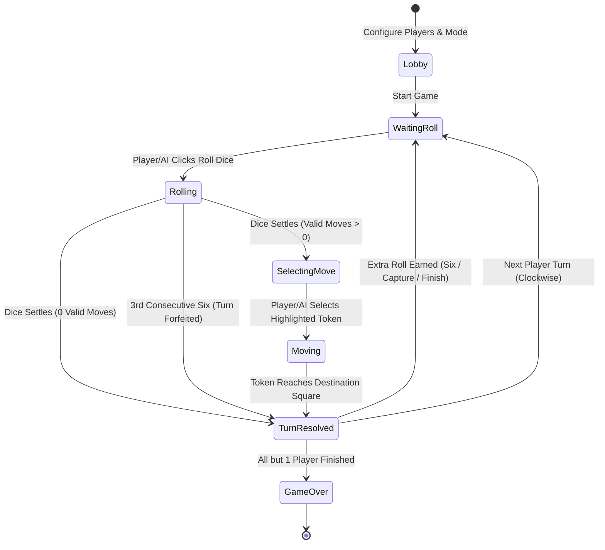

# Data Model: Ludo Game with Multiplayer & Computer AI

**Feature**: `001-ludo-multiplayer-ai` | **Date**: 2026-08-17

This document defines the core domain entities, data schemas, state transitions, and validation rules for the Ludo game system.

---

## 1. Domain Entities & Type Definitions

```typescript
export type PlayerColor = 'red' | 'green' | 'yellow' | 'blue';

export type SlotType = 'local_human' | 'ai_bot' | 'remote_player';

export type AIDifficulty = 'casual' | 'balanced' | 'strategic';

export type TokenState = 'base' | 'track' | 'home_path' | 'finished';

export type GameMode = 'vs_ai' | 'pass_and_play' | 'online_room';

export type GamePhase = 
  | 'lobby'          // Selecting player modes, counts, and difficulties
  | 'waiting_roll'   // Active player must roll the dice
  | 'rolling'        // Dice animation actively playing
  | 'selecting_move' // Dice rolled; waiting for player or AI to pick a token
  | 'moving'         // Token is animating step-by-step
  | 'turn_resolved'  // Move completed, evaluating captures or extra turns
  | 'game_over';     // Match completed; displaying winners podium
```

---

## 2. Entity Schemas

### `Token`
Represents one of a player's 4 game pieces.

```typescript
export interface Token {
  id: string;                  // e.g. "red-0", "blue-3"
  playerIndex: number;         // 0..3
  color: PlayerColor;          // 'red' | 'green' | 'yellow' | 'blue'
  tokenIndex: number;          // 0..3
  state: TokenState;           // 'base' | 'track' | 'home_path' | 'finished'
  stepCount: number;           // -1 (base), 0..50 (outer track), 51..55 (home path), 56 (center home)
  globalPos: number | null;    // 0..51 when on outer track, null otherwise
  isEligible: boolean;         // true if selectable for current dice roll
}
```

### `Player`
Represents one of the 4 colored board quadrants and its controller.

```typescript
export interface Player {
  index: number;               // 0 (Red), 1 (Green), 2 (Yellow), 3 (Blue)
  name: string;                // Display name
  color: PlayerColor;          // Assigned quadrant color
  slotType: SlotType;          // 'local_human' | 'ai_bot' | 'remote_player'
  difficulty: AIDifficulty;    // Used when slotType === 'ai_bot'
  tokens: Token[];             // Array of 4 tokens
  tokensInBase: number;        // Count (0..4)
  tokensFinished: number;      // Count (0..4)
  hasWon: boolean;             // True when all 4 tokens reach step 56
  finishRank: number | null;   // 1 (1st), 2 (2nd), 3 (3rd), 4 (4th), null if active
  avatarId: string;            // Avatar visual identifier
  isActive: boolean;           // True if current turn belongs to this player
}
```

### `DiceState`
Tracks dice value, animation locks, and rolling rules.

```typescript
export interface DiceState {
  currentValue: number;        // 1..6
  isRolling: boolean;          // Animation mutex lock
  consecutiveSixes: number;    // Count (0..3)
  eligibleTokenIds: string[];  // IDs of tokens that can legally move
  lastRolledTimestamp: number;
}
```

### `GameState`
The complete, self-contained, serializable state of a game.

```typescript
export interface GameState {
  id: string;                  // Unique match UUID
  mode: GameMode;              // 'vs_ai' | 'pass_and_play' | 'online_room'
  phase: GamePhase;            // Current game stage
  activePlayerIndex: number;   // 0..3
  players: Player[];           // 2, 3, or 4 players
  dice: DiceState;             // Current dice status
  turnCount: number;           // Total turns played
  winnerList: number[];        // Ordered player indices who have finished
  history: MoveRecord[];       // Audit log of all moves
  lastMove: MoveRecord | null; // Most recent action for highlight rendering
  soundEnabled: boolean;       // Audio mute flag
  hapticsEnabled: boolean;     // Vibration toggle
}
```

### `MoveRecord`
Describes a single token move transaction.

```typescript
export interface MoveRecord {
  turnIndex: number;
  playerId: string;
  tokenId: string;
  diceValue: number;
  fromStep: number;
  toStep: number;
  fromGlobalPos: number | null;
  toGlobalPos: number | null;
  capturedTokenId: string | null;
  earnedExtraRoll: boolean;
  extraRollReason: 'rolled_six' | 'captured_opponent' | 'entered_home' | null;
  timestamp: number;
}
```

---

## 3. State Transitions & Turn State Machine



---

## 4. Validation Rules & Invariants

1. **Token Deployment**: A token at `stepCount = -1` can ONLY move if `dice.currentValue === 6`. Its target is `stepCount = 0`.
2. **Exact Home Finish**: A token at step $S \ge 51$ can only move if $S + \text{dice.currentValue} \le 56$. If $S + \text{dice.currentValue} > 56$, the move is invalid.
3. **Safe Square Protection**: Non-capturable squares are indexed at global positions:
   $$\text{Safe Squares} = \{0, 8, 13, 21, 26, 34, 39, 47\}$$
   Multiple tokens of any color may occupy these squares without triggering captures.
4. **Three Consecutive Sixes**: If a player rolls `dice.currentValue === 6` three times in succession without completing a turn, `dice.consecutiveSixes = 3`, the 3rd roll is canceled, and the turn automatically rotates to the next active player.
5. **Auto-Advance**: If `eligibleTokenIds.length === 0`, turn advances to next player after a 0.8s notification banner.
