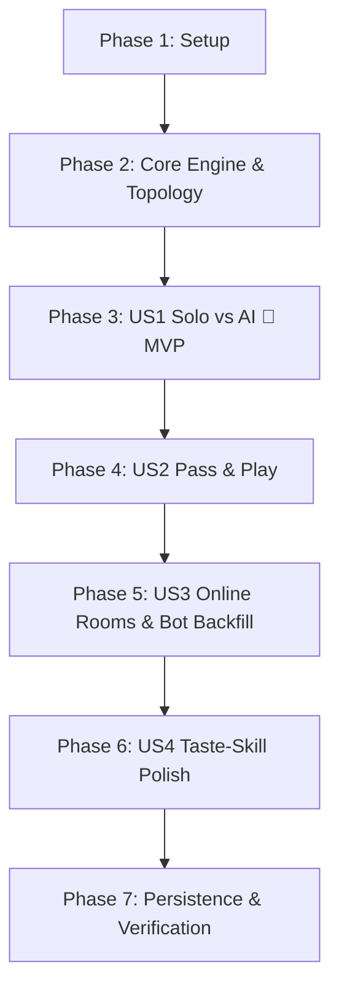

# Tasks: Ludo Game with Multiplayer & Computer AI

**Input**: Design documents from `specs/001-ludo-multiplayer-ai/`  
**Prerequisites**: `plan.md` (required), `spec.md` (required for user stories), `research.md`, `data-model.md`, `contracts/`  
**Organization**: Tasks are grouped by user story to enable independent implementation and testing of each story.

## Format: `- [ ] [TaskID] [P?] [Story?] Description with file path`

- **[P]**: Can run in parallel (different files, no dependencies)
- **[Story]**: Which user story this task belongs to (`[US1]`, `[US2]`, `[US3]`, `[US4]`)
- Every task includes the exact file path

---

## Phase 1: Setup (Shared Infrastructure)

**Purpose**: Project initialization, build setup, and Taste-Skill design foundation.

- [ ] T001 Initialize TypeScript web project structure and package configuration in `package.json` and `tsconfig.json`
- [ ] T002 [P] Configure Vite dev server and HTML entrypoint in `vite.config.ts` and `index.html`
- [ ] T003 [P] Setup Taste-Skill design tokens, dark/light palette, and CSS reset in `src/styles/index.css`

---

## Phase 2: Foundational (Core Game Engine & Rules)

**Purpose**: Headless state machine and topology that MUST be complete before ANY user story can be implemented.

- [ ] T004 [P] Define core domain types (`Player`, `Token`, `GameState`, `MoveRecord`) in `src/engine/Types.ts`
- [ ] T005 [P] Implement 52-tile track coordinate mapping, safe star squares, and home path math in `src/engine/BoardTopology.ts`
- [ ] T006 Implement Ludo rules validation (token release on 6, legal moves, capture conditions, 3-sixes forfeiture) in `src/engine/LudoRules.ts`
- [ ] T007 Implement headless `LudoEngine` state machine with state subscriptions and turn management in `src/engine/LudoEngine.ts`
- [ ] T008 [P] Implement zero-dependency Web Audio procedural sound synthesizer (dice shaker, token hop, capture impact, victory fanfare) in `src/audio/SoundManager.ts`

**Checkpoint**: Foundation ready — game logic can be fully simulated headless.

---

## Phase 3: User Story 1 - Solo Play vs Computer AI (Priority: P1) 🎯 MVP

**Goal**: Enable a solo human player to start a match against 1, 2, or 3 AI bots and complete a full game of Ludo.

**Independent Test**: Launch game in solo mode against 3 bots, roll dice, release tokens, capture opponent tokens, and win match with all 4 tokens in center home.

- [ ] T009 [P] [US1] Implement AI move evaluation heuristics (capture scoring, safety, escape, token release) in `src/ai/Heuristics.ts`
- [ ] T010 [US1] Implement `LudoAI` decision agent with difficulty modes (Casual, Balanced, Strategic) and natural human-like thinking delays in `src/ai/LudoAI.ts`
- [ ] T011 [P] [US1] Implement high-DPI SVG/Canvas board layout with colored quadrants, tracks, and safe stars in `src/ui/BoardRenderer.ts`
- [ ] T012 [P] [US1] Implement 3D CSS tumbling dice with physics, face mapping, and roll interaction in `src/ui/DiceRenderer.ts`
- [ ] T013 [US1] Implement active player indicators, color trays, and turn notification banners in `src/ui/TurnIndicator.ts`
- [ ] T014 [US1] Wire solo game loop with AI bot auto-rolling and token transitions in `src/main.ts`
- [ ] T015 [US1] Implement victory celebration modal with podium rankings and rematch triggers in `src/ui/VictoryModal.ts`

**Checkpoint**: User Story 1 (MVP) is fully functional and playable single-player.

---

## Phase 4: User Story 2 - Pass & Play Local Multiplayer (Priority: P2)

**Goal**: Support 2 to 4 local human players alternating turns on a single shared device.

**Independent Test**: Start a 3-player local match, alternate turns clockwise, select from multiple eligible tokens, and verify turn handoffs.

- [ ] T016 [P] [US2] Implement Game Mode and Player Setup Lobby Modal (2-4 players, color picker, local human/bot toggle) in `src/ui/LobbyModal.ts`
- [ ] T017 [US2] Implement multi-token selection and glowing path projection highlighting for active player in `src/ui/BoardRenderer.ts`
- [ ] T018 [US2] Implement automatic single-move execution and turn auto-advancement when 0 moves are possible in `src/engine/LudoEngine.ts`
- [ ] T019 [US2] Integrate Pass & Play turn transitions and color-matched trays in `src/main.ts`

**Checkpoint**: User Stories 1 AND 2 are both playable.

---

## Phase 5: User Story 3 - Online Room Multiplayer with Bot Backfill (Priority: P3)

**Goal**: Peer-to-peer room hosting with 6-character room codes and automatic bot substitution if players disconnect or slots remain open.

**Independent Test**: Host a 4-player room with 2 humans, fill remaining seats with bots, and disconnect one human to verify immediate AI proxy takeover without crashing the session.

- [ ] T020 [P] [US3] Implement room protocol schemas, message serialization, and event types in `src/network/Protocol.ts`
- [ ] T021 [US3] Implement Peer-to-Peer (WebRTC) room coordinator with 6-character room codes in `src/network/RoomManager.ts`
- [ ] T022 [US3] Implement 15-second heartbeat monitor and automatic AI bot proxy takeover for disconnected/unfilled seats in `src/network/RoomManager.ts`
- [ ] T023 [US3] Implement Online Room UI in lobby (Create Room, Join Room, Copy Link, Ready Status) in `src/ui/LobbyModal.ts`
- [ ] T024 [US3] Integrate network message dispatch with local `LudoEngine` and `LudoAI` in `src/main.ts`

**Checkpoint**: Online room multiplayer is fully operational with automatic bot backfill.

---

## Phase 6: User Story 4 - Bespoke Taste-Skill UI/UX, Audio & Tactile Feel (Priority: P4)

**Goal**: Deliver premium visual aesthetics, responsive mobile scaling (`100dvh`), tactile haptics, and audio polish.

**Independent Test**: Test across mobile (375px) to 4K viewports, verify zero layout shifts, smooth 60fps token movement physics, and responsive audio toggles.

- [ ] T025 [P] [US4] Implement dynamic viewport scaling with `min-h-[100dvh]` lock, preventing layout jumping on mobile browsers in `src/styles/index.css`
- [ ] T026 [P] [US4] Add glowing trail animations and step-by-step token hop physics in `src/ui/BoardRenderer.ts`
- [ ] T027 [P] [US4] Add haptic vibration triggers on mobile devices for dice rolls, captures, and victory in `src/audio/SoundManager.ts`
- [ ] T028 [US4] Add persistent sound and haptic mute toggles in top navigation header in `src/main.ts`

---

## Phase 7: Polish & Cross-Cutting Concerns

**Purpose**: Persistence, accessibility compliance, and final end-to-end validation.

- [ ] T029 Implement LocalStorage match autosave & state recovery so accidental refreshes preserve game progress in `src/engine/LudoEngine.ts`
- [ ] T030 [P] Conduct WCAG AA contrast audit and keyboard navigation accessibility check across all buttons and dice controls in `src/styles/index.css`
- [ ] T031 Execute end-to-end quickstart validation scenarios (Solo vs 3 AI, 4-Player Pass & Play, Bot Takeover) per `specs/001-ludo-multiplayer-ai/quickstart.md`

---

## Dependencies & Completion Order

---

## Implementation Strategy

1. **MVP First (Phase 1–3)**: Deliver a complete, playable Solo vs AI Ludo game with 3D dice physics and sound effects.
2. **Local Multiplayer (Phase 4)**: Add the Pass & Play lobby and multi-player turn indicator trays.
3. **Networked Rooms (Phase 5)**: Add WebRTC peer-to-peer rooms with resilient AI bot takeover.
4. **Final Polish (Phase 6–7)**: Lock responsive `100dvh` viewport stability, LocalStorage persistence, and WCAG AA contrast.
